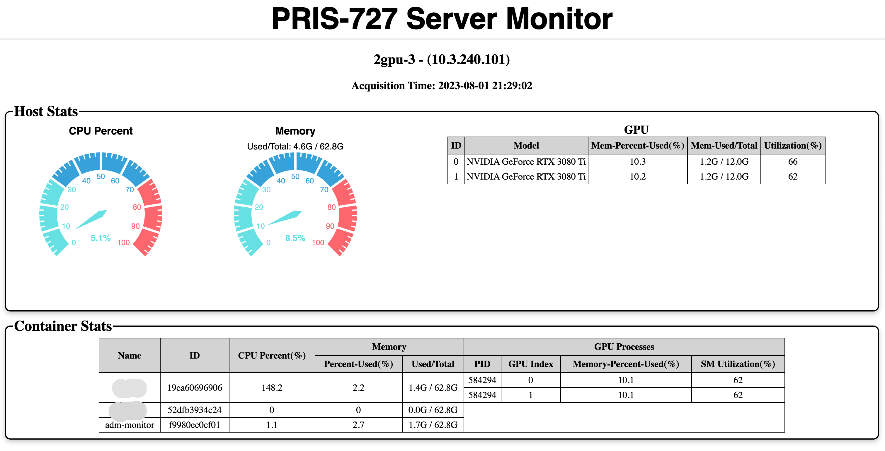

# Container Monitor


# Introduction

This is a very simple container monitor, showing basic host states (CPU, memory, GPU) and container states (ID, Name, CPU, memory, GPU processes). Suitable for this kind of situation: there are multiple users using the same GPU server in each other's docker container, you want users to be able to know about the load states of the host in realtime without accessing the physical host.



This repo provides a web application displaying state information. The application does not persist any state data, only displaying current states. State collection will be paused if there is no client accessing latest states lasting for more than the threshold (30 seconds by default), in order to save reduce running overhead. And the application itself can be deployed as a container.

Q: Why not Prometheus + Grafana, or other mature container monitoring tools?

A: Some tools depends on k8s, other than simply Docker. And some tools do not provide monitoring on GPUs (e.g. [cAdvisor](https://github.com/google/cadvisor/tree/master)). And some tools run in command line and need users to access physical host. After much searching, I did not find a simple and satisfying tool to meet my demand, so I develop this. 

Libraries adopted: 
- Collecting stats: [nvitop](https://github.com/XuehaiPan/nvitop#for-docker-users) and [Docker SDK for Python](https://github.com/docker/docker-py)
- Frontend: 
    - AJAX requests: [axios](https://github.com/axios/axios)
    - Gauge charts: [ECharts](https://github.com/apache/echarts)
- Backend: [Flask](https://github.com/pallets/flask)
- Server: [Gunicorn](https://github.com/benoitc/gunicorn) + [Nginx](https://nginx.org) + [Supervisor](https://github.com/Supervisor/supervisor)


# Usage

## 1. Clone this repo and build a docker image using the Dockerfile

Clone this repo, enter the directory of this repo, and:

```shell
docker build -t monitor:latest .
```


Besides building docker image locally, you can simply pull latest image from Docker Hub. A Github Action for building and pushing docker image has been added, latest docker image will be updated automatically once there is git commit to branch "main". You can pull the image from [Docker Hub](https://hub.docker.com/repository/docker/alive1024/727-monitor).

## 2. Start a monitor container

The container needs to be able to access host's docker, there are two ways to achieve this, and hence there are two different startup methods.

### 2.1 Mount docker.sock into the container

```shell
docker run -itd --restart=unless-stopped --gpus=all --pid=host --network=host \
-v /var/run/docker.sock:/var/run/docker.sock \
-v /etc/localtime:/etc/localtime \
--name adm-monitor alive1024/727-monitor
```

In the command above, `-v /var/run/docker.sock:/var/run/docker.sock` is to mount docker.sock into the container. 

Note: 
- In order to display host's hostname and IP address correctly, host network mode is adopted instead of default "bridge" (`--network=host`). For details, refer to [🔗](https://stackoverflow.com/questions/24319662/from-inside-of-a-docker-container-how-do-i-connect-to-the-localhost-of-the-mach). In this way, port mapping is no more needed, we can access specific port directly.
- The nginx listening port has been set as 727 by default (see `configs/nginx.conf` - `http` - `server` - `listen`).
- In some case, even if `--network=host` has been specified, specific port is not available from outside for unknown reason. If you meet this unfortunately, the current temporary solution is to remove `--network=host` and add a port mapping like `-p 727:727` (suppose that the nginx port has been set as 727). However, the hostname and IP address cannot be displayed correctly, they will be the container itself's information other than the physical host's.


### 2.2 Configure remote access for Docker daemon

First of all, the host's docker should be configured to make remote access available. Follow instructions from offical doc: [Configure remote access for Docker daemon](https://docs.docker.com/config/daemon/remote-access/). Note that `collector.py` uses port 2375 by default.

In this way, mounting docker.sock or docker command is no longer needed.

```shell
docker run -itd --restart=unless-stopped --gpus=all --pid=host --network=host \
-v /etc/localtime:/etc/localtime \
--name adm-monitor alive1024/727-monitor
```

As stated by docker offical, the 2nd way is **DANGEROUS**, prioritize the 1st way.


## 3. Check the states

Open a browser and access `<IP address>:<port>`.


# Memorandum

This section records the structure of collection results of `collector.py` for reference when developing. No need reading if you just use this tool.

Result example of collector's `get_stats`:

```json
{
    "time": "2023-08-01 21: 54: 32",
    "hostname": "2gpu-3",
    "ip": "10.3.240.101",
    "note": "",
    "host-stats": {
        "cpu-perc": 5.9,
        "mem": {
            "perc-used": 8.5,
            "used/total": "4.6G / 62.8G"
        },
        "gpu": [
            {
                "id": 0,
                "model": "NVIDIA GeForce RTX 3080 Ti",
                "mem-perc-used": 10.3,
                "mem-used/total": "1.2G / 12.0G",

                "util-perc": 72
            },
            {
                "id": 1,
                "model": "NVIDIA GeForce RTX 3080 Ti",
                "mem-perc-used": 10.2,
                "mem-used/total": "1.2G / 12.0G",
                "util-perc": 71
            }
        ]
    },
    "container-stats": {
        "19ea60696906": {
            "name": "my-container-1",
            "cpu-perc": 145.1,
            "mem": {
                "perc-used": 2.2,
                "used/total": "1.4G / 62.8G"
            },
            "gpu-proc": [
                {
                    "gpu-idx": 0,
                    "mem-perc-used": 10.1,
                    "pid": 678400,
                    "sm-util": 62
                },
                {
                    "gpu-idx": 1,
                    "mem-perc-used": 10.1,
                    "pid": 678400,
                    "sm-util": 62
                }
            ]
        },
        "52dfb3934c24": {
            "name": "my-container-2",
            "cpu-perc": 0.0,
            "mem": {
                "perc-used": 0.0,
                "used/total": "0.0G / 62.8G"
            },
            "gpu-proc": []
        },
        "f9980ec0cf01": {
            "name": "adm-monitor",
            "cpu-perc": 1.1,
            "mem": {
                "perc-used": 2.7,
                "used/total": "1.7G / 62.8G"
            },
            "gpu-proc": []
        }
    }
}
```

`_get_gpu_process_stats` returns a list of dict(s) as intermediate results, e.g.:
```json
{
    "pid": 12345,
    "gpu-idx": 0,
    "mem-perc-used": 31.0,
    "mem-used": "1.2G",
    "sm-util": 97,
}
```
